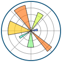
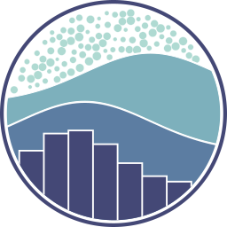

<!-- <h1 align="center">
    Hello world
    
     
    I am Pranav Rustagi
</h1> -->

<!-- 
 -->
<!-- 
 -->

### Hello World 
# I am **Pranav Rustagi**

 
 
 

# About me

👉🏼 Postgraduate in <b>Master of Computer Applications</b> from <b>NIT Kurukshetra</b>

👉🏼 <b>Software Development Engineer</b> intern at <b>Genpact</b> exploring <b>Generative AI</b>

👉🏼 Experienced <b>Web Developer</b> specializing in <b>frontend</b> technologies
        
👉🏼 <b>Competitive Programming</b> enthusiast

 
 
 

# Skillset

### Web Development
&nbsp;
&nbsp;
&nbsp;
&nbsp;
&nbsp;
&nbsp;
&nbsp;
&nbsp;
&nbsp;
&nbsp;
&nbsp;
&nbsp;
&nbsp;
&nbsp;
&nbsp;

### Machine Learning

&nbsp;&nbsp;

&nbsp;&nbsp;

&nbsp;&nbsp;

&nbsp;&nbsp;

&nbsp;&nbsp;

&nbsp;&nbsp;
&nbsp;

### Other tools and technologies
&nbsp;
&nbsp;
&nbsp;
&nbsp;
&nbsp;
&nbsp;

### Problem Solving and competitive programming

 
 
 

# Profiles

### Socials
&nbsp;&nbsp;
&nbsp;&nbsp;
&nbsp;&nbsp;

### Competitive Programming
&nbsp;&nbsp;
&nbsp;&nbsp;
&nbsp;&nbsp;
&nbsp;&nbsp;
&nbsp;&nbsp;

 
 
 

# Developer Statistics

    
    &nbsp;&nbsp;
    
     
     
    &nbsp;&nbsp;
    <!-- &nbsp;&nbsp; -->
    

<!-- # Github Trophies
 -->

<!-- ### **Holo pins**
 -->